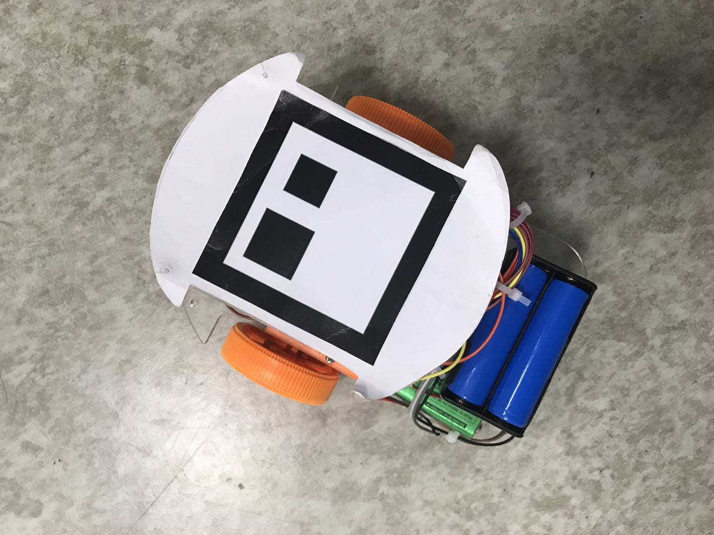

# Robot-car-DRL

#### More images about robot-car-agent, please go to /Pics/ :)

## 2017.02.22

### 1.1 Async-threads Communication:
> Threads can be run at background, so you can't expect them executed in sequence!!!  But according to your thread "run(self)" function, those logics are run sequencially!!!!!

### 1.2 Solution:
> Make sure your don't get lost in one previous loop, but actually you think you can update this variable, which related to jump out the loop in next sequencial function.

> Also, in mul-threads programming, the lock.acquire() and  lock.release() are PAIRED at any moment. Make sure you touch the shared variables with "lock".

##  2017.02.21

### 1.1 Communication Model:
>  PC <--> esp8266 (known as wifi module) <--> Arduino (Uart)

>  Usually, if we only use esp8266 to receive mesg but not feedback. If we want to feedback at same rate (50ms etc.), arduino's own Uart buffer would have conflicts whenwe try to read and write mesg at almost the same time.
>  Received mesg and mesg want to give back to PC would "interwined" in Arduino buffer. Especially when esp8266 module needs some delay (probablely 20~50ms) to between a "SEND" command and preping well for your input data. However, the best way to check if you need to consider this problem in fast communication rate is to open "Arduino's Serial Monitor" to have a close look on the buffer.

### 1.2 Solution:
>  Command sent-out rate from PC is set to ~200ms, and Arduino send a "Send" command to esp8266 at about first 50ms as soon as it recognizes the formatted command, and then write back the feedback info. Then it delay the rest of the time (for about 130ms), then check the buffer and see if there is any new command info. 